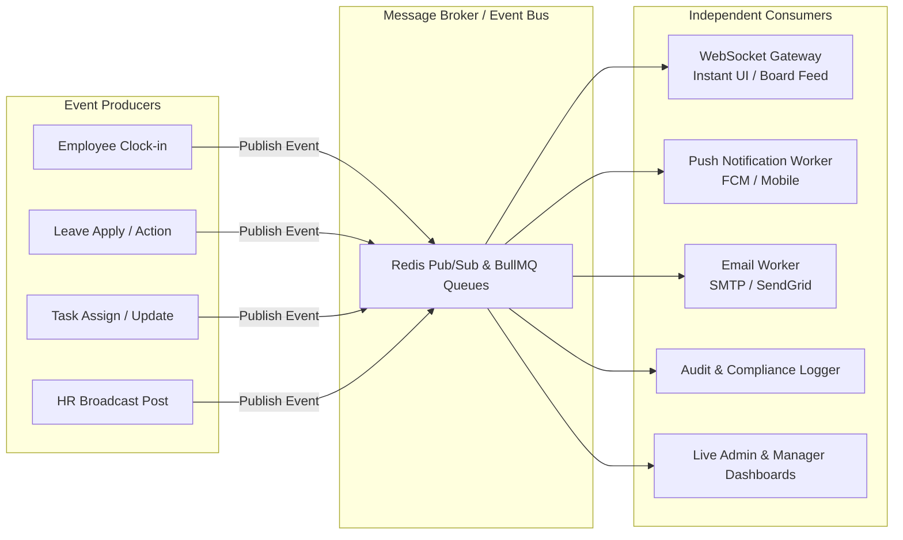
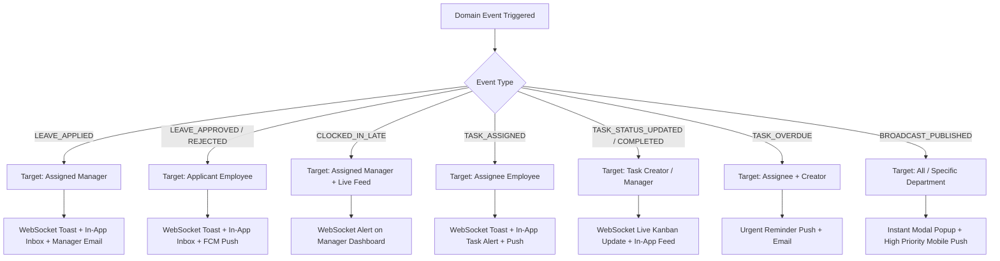
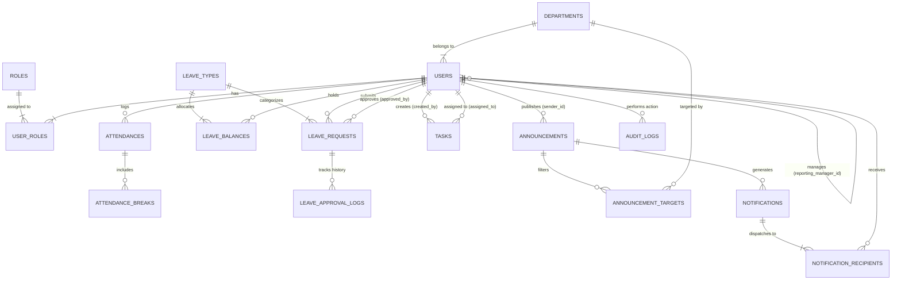
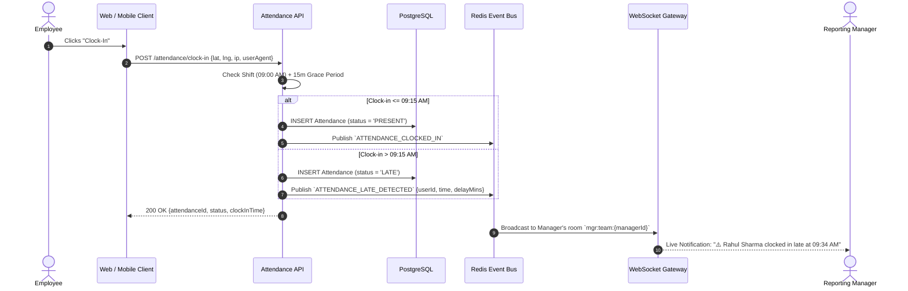
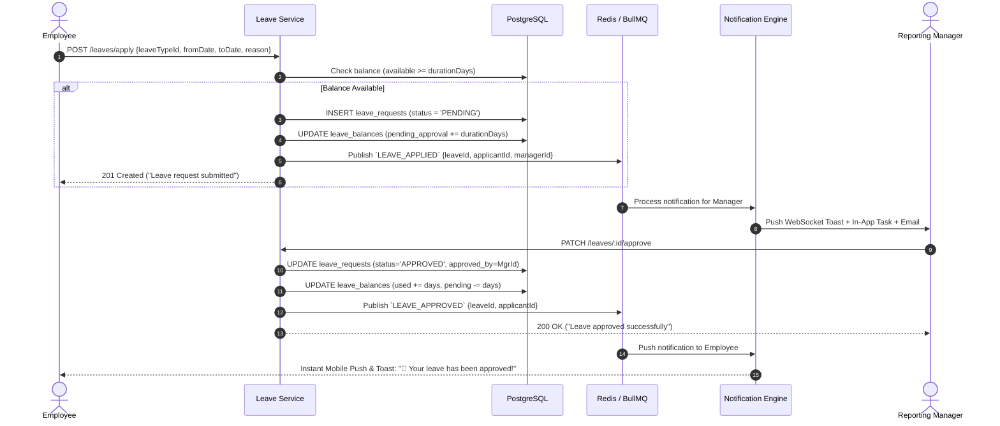
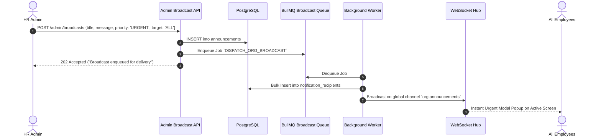
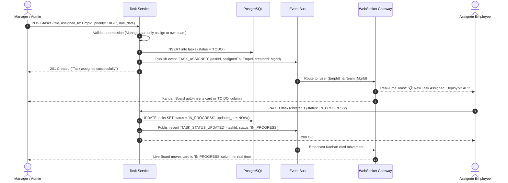
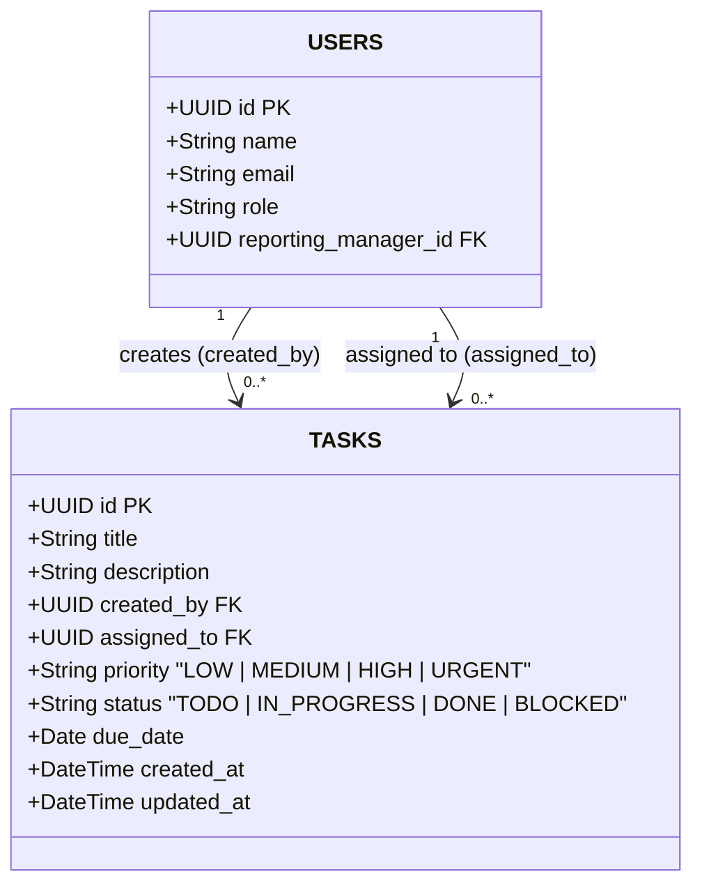

# 🏢 Enterprise HRMS & Company Operations Management Suite
## Complete System Design, Architecture (EDA & TDA), Schema, API & Role Matrix Blueprint

---

## 📑 Table of Contents
1. [Executive Summary & System Overview](#1-executive-summary--system-overview)
2. [Deep Architectural R&D: EDA & TDA](#2-deep-architectural-rd-eda--tda)
   - [A. Event-Driven Architecture (EDA)](#a-event-driven-architecture-eda)
   - [B. Tell, Don't Ask (TDA) & Clean Layered Architecture](#b-tell-dont-ask-tda--clean-layered-architecture)
   - [C. Hybrid Pattern: TDA Core + EDA Boundary](#c-hybrid-pattern-tda-core--eda-boundary)
3. [Enterprise System Architecture Flow](#3-enterprise-system-architecture-flow)
4. [Role Hierarchy & Granular Permission Matrix](#4-role-hierarchy--granular-permission-matrix)
5. [Notification & Event Routing Matrix](#5-notification--event-routing-matrix)
6. [Entity Relationship (ER) Diagram](#6-entity-relationship-er-diagram)
7. [Production Database Schema (PostgreSQL DDL)](#7-production-database-schema-postgresql-ddl)
8. [End-to-End Business Flow Sequences](#8-end-to-end-business-flow-sequences)
   - [A. Employee Daily Attendance & Late Mark Flow](#a-employee-daily-attendance--late-mark-flow)
   - [B. Leave Application, Validation & Approval Flow](#b-leave-application-validation--approval-flow)
   - [C. HR/Admin Company-Wide Broadcast Flow](#c-hradmin-company-wide-broadcast-flow)
   - [D. Task Assignment & Real-Time Kanban Lifecycle Flow](#d-task-assignment--real-time-kanban-lifecycle-flow)
9. [Enterprise Dashboard UI & Metrics Specification](#9-enterprise-dashboard-ui--metrics-specification)
10. [Task Tracking & Operational Delegation Engine](#10-task-tracking--operational-delegation-engine)
    - [10.1 Who Can Create / Assign Tasks (Role Rules)](#101-who-can-create--assign-tasks-role-rules)
    - [10.2 Tasks Entity Details & Constraints](#102-tasks-entity-details--constraints)
    - [10.3 Event-Driven Architecture (EDA) for Tasks](#103-event-driven-architecture-eda-for-tasks)
    - [10.4 Notification Routing Rules for Tasks](#104-notification-routing-rules-for-tasks)
    - [10.5 Task Module API Endpoints](#105-task-module-api-endpoints)
11. [Complete REST & WebSocket API Specification](#11-complete-rest--websocket-api-specification)
12. [Security, Concurrency & Edge-Case Handling](#12-security-concurrency--edge-case-handling)
13. [Recommended Tech Stack & Implementation Roadmap](#13-recommended-tech-stack--implementation-roadmap)

---

## 1. Executive Summary & System Overview

Yeh system ek **Enterprise-grade HRMS & Operations Platform** hai jiska maksad organization ke har level (Admin, Manager, Employee) ke operations ko streamline aur automate karna hai. 

### Core Business Capabilities:
* **Strict Role-Based Multi-Tenancy / Scoping**:
  * **Admin / HR Admin**: Poori company ka 360-degree control, employee onboarding, manager assignment, leave policy customization, direct approval overrides, company-wide broadcasts, task delegation across any team, org-wide live attendance & analytics reports.
  * **Manager**: Apni direct reporting team (`manager_id` hierarchy) ka management, live team attendance roster, late clock-in alerts, team leave approval/rejections, team task delegation/re-assignment, aur team performance/leave reports.
  * **Employee**: Self-service portal — One-tap Clock-In/Clock-Out, break logging, leave balance tracker, leave application, self-task creation & status tracker (To Do $\rightarrow$ In Progress $\rightarrow$ Done), real-time in-app notification center, aur personal monthly timesheets.
* **Smart Attendance Engine**: Geofencing / IP restriction, shift grace period, auto late-marking, total working hours & break tracking, auto clock-out cron, and missing-punch regularization.
* **Robust Leave Workflow**: Multi-type leaves (Sick, Casual, Paid, Maternity), annual quota allocation, balance deduction on approval, manager-level and admin-level override approval flows.
* **Task Tracking & Delegation Engine**: Role-scoped task creation, team assignment, re-assignment, priority/due-date alerts, live Kanban board synchronization, and automated overdue cron reminders.
* **Instant Notification Hub**: Event-driven architecture jisme system ka har state change (Leave apply, approve, reject, late clock-in, task assigned, status updated, HR announcement) bina UI delay ke instant WebSocket alert, Email, aur Mobile Push notification deliver karta hai.

---

## 2. Deep Architectural R&D: EDA & TDA

### A. Event-Driven Architecture (EDA)
**Event-Driven Architecture (EDA)** ek aisa design pattern hai jisme components direct direct synchronous call karne ke bajaye **"Domain Events"** emit aur consume karte hain.

#### Why EDA is Required for this HRMS:
1. **Zero Latency on User Actions**: Jab HR 500+ employees ko urgent announcement bhejta hai, Manager task assign karta hai, ya Employee clock-in karta hai, toh main thread block nahi hoti. Controller instant response return karta hai aur background workers notifications, emails, aur websocket broadcasts dispatch karte hain.
2. **Decoupled Subscribers**: Naye consumers (e.g. Slack bot alert, Payroll processor, Task audit logger) add karne ke liye core business code me koi modification nahi karni padti.

#### Core Domain Events in System:
* `AUTH_USER_LOGGED_IN`
* `ATTENDANCE_CLOCKED_IN`
* `ATTENDANCE_LATE_DETECTED` (Triggered when Clock-in > Shift Start + Grace Period)
* `ATTENDANCE_CLOCKED_OUT`
* `LEAVE_APPLIED`
* `LEAVE_APPROVED`
* `LEAVE_REJECTED`
* `LEAVE_CANCELLED`
* `TASK_CREATED` (Self-task logged)
* `TASK_ASSIGNED` (Task assigned/delegated to someone)
* `TASK_STATUS_UPDATED` (Moved to In-Progress / Done)
* `TASK_COMPLETED` (Marked as Done)
* `TASK_OVERDUE` (Triggered by automated cron scanner)
* `HR_BROADCAST_PUBLISHED`



---

### B. Tell, Don't Ask (TDA) & Clean Layered Architecture

#### 1. The TDA Principle Explained
**"Tell, Don't Ask"** OOP and Domain-Driven Design ka golden rule hai. Iska matlab hai: **Kisi entity se uska data mang kar bahar logic execute mat karo (Don't Ask), balki entity ko seedha command do ki wo apne internal business rules khud enforce kare (Tell).**

* ❌ **Bad (Violating TDA - Asking & Anemic Domain)**:
  ```ts
  // Controller / Service asks data and performs calculations outside:
  if (task.assignedTo === user.id && newStatus === "DONE") {
      task.status = "DONE";
      task.updatedAt = new Date();
      await taskRepo.save(task);
  }
  ```

* ✅ **Good (Adhering to TDA - Rich Domain Model)**:
  ```ts
  // Controller tells the entity to execute its behavior:
  task.markAsCompleted(currentUser);
  // Inside Task Entity:
  // - Validates that currentUser is either assignee, creator, or admin
  // - Validates state transition rules (TODO -> IN_PROGRESS -> DONE)
  // - Updates timestamp
  // - Emits domain event: TASK_COMPLETED
  ```

---

## 3. Enterprise System Architecture Flow

```mermaid
flowchart TB
    subgraph Client Apps
        WebAdmin[Admin & HR Web Portal <br/> Next.js / React]
        WebManager[Manager Team Portal]
        WebEmp[Employee Portal / PWA]
    end

    subgraph Gateway & Security
        NGINX[Reverse Proxy / Nginx / Cloudflare]
        GW[API Gateway & Rate Limiter]
        JWTMw[JWT & RBAC Middleware]
        TenantScope[Manager-Team Isolation Filter]
    end

    subgraph Application Core Modules
        AuthMod[Auth & Profile Module]
        AttMod[Attendance & Geofence Engine]
        LeaveMod[Leave Management & Policy Engine]
        TaskMod[Task Tracking & Delegation Engine]
        BroadMod[HR Broadcast & Announce Engine]
        ReportMod[Reports & Analytics Engine]
    end

    subgraph Asynchronous Event Bus & Workers
        RedisBus[(Redis Streams / PubSub)]
        BullQueue[(BullMQ Background Jobs)]
        WSGateway[WebSocket Live Gateway]
        EmailWorker[Email Notification Service]
        PushWorker[Mobile Push FCM Service]
        CronWorker[Midnight Auto-Clockout & Task Overdue Cron]
    end

    subgraph Data & Storage Layer
        PostgreSQL[(PostgreSQL Master DB <br/> ACID Transactions)]
        RedisCache[(Redis In-Memory Cache <br/> Live Attendance Cache)]
        S3Bucket[(S3 Storage <br/> Medical Slips & Attachments)]
    end

    Client Apps -->|HTTPS / WSS| NGINX
    NGINX --> GW
    GW --> JWTMw --> TenantScope
    TenantScope --> Application Core Modules

    Application Core Modules -->|Read/Write ACID| PostgreSQL
    Application Core Modules -->|Fast Session / Lock| RedisCache
    Application Core Modules -->|Upload Attachments| S3Bucket

    Application Core Modules -->|Publish Domain Events| RedisBus
    RedisBus --> BullQueue
    BullQueue --> WSGateway
    BullQueue --> EmailWorker
    BullQueue --> PushWorker
    BullQueue --> CronWorker

    WSGateway -->|Push Live Events| Client Apps
```

---

## 4. Role Hierarchy & Granular Permission Matrix

The application strictly implements 3 core role scopes:
1. **Admin / HR Admin**: Global Organization Scope.
2. **Manager**: Direct Team Scope (Employees where `reporting_manager_id == current_manager_id`).
3. **Employee**: Self Scope only (`user_id == current_user_id`).

### Complete Role Permissions Breakdown

| Action / Capability | Employee | Manager | Admin / HR Admin | Enforcement Mechanism |
|---|:---:|:---:|:---:|---|
| **Clock-In / Clock-Out** | ✅ (Self) | ✅ (Self) | ✅ (Self) | JWT User Context |
| **View Personal Attendance History** | ✅ | ✅ | ✅ | `WHERE user_id = auth.uid` |
| **View Team Live Attendance & Roster** | ❌ | ✅ (Own Team) | ✅ (All Org) | Manager ID scoping query |
| **Override / Regularize Attendance Punch** | ❌ | ❌ | ✅ | Admin Role Guard + Audit Log |
| **Apply for Leave** | ✅ (Self) | ✅ (Self) | ✅ (Self) | Balance check & validation |
| **Approve / Reject Leave Request** | ❌ | ✅ (Own Team) | ✅ (Any Employee) | Manager ownership or Admin Guard |
| **Create Task for Self** | ✅ | ✅ | ✅ | Open to all |
| **Assign Task to Someone Else** | ❌ (Self-only) | ✅ (Own Team only) | ✅ (Anyone in Org) | Scoped Manager Filter |
| **Re-assign a Task to Another Person** | ❌ | ✅ (Own Team) | ✅ (Anyone) | Manager Team Validation |
| **Change Status of Assigned Task** | ✅ (Assigned to me) | ✅ | ✅ | Assignee / Manager Guard |
| **View Team Task Board (Kanban)** | ❌ | ✅ (Own Team) | ✅ (All Org) | Scoped Board Query |
| **Delete / Close a Task** | ✅ (Own only) | ✅ (Own Team's) | ✅ (Any) | Ownership / Hierarchy Check |
| **Set Priority / Due Date** | ✅ (Own tasks) | ✅ (Own + Team's) | ✅ (Any) | Role-Based Task Policy |
| **Publish Broadcast / Announcement** | ❌ | ❌ | ✅ (Org / Dept) | Admin / HR Only |
| **Live Admin Dashboard & Aggregated KPIs** | ❌ | ❌ | ✅ | Admin Guard |
| **Generate & Export CSV/PDF Reports** | ✅ (Self) | ✅ (Team) | ✅ (Org-wide) | Role-filtered export service |

---

## 5. Notification & Event Routing Matrix

System me hone wale har event ke liye specific routing logic aur delivery channels define hain:



### Detailed Routing Rule Table

| Event Key | Trigger Condition | Assignee / Applicant Gets | Creator / Manager Gets | Admin Gets |
|---|---|---|---|---|
| `LEAVE_APPLIED` | Employee submits leave | In-app confirmation | **Instant WS Alert + Email + In-app Task** | Dashboard counter increment |
| `LEAVE_APPROVED` | Manager or Admin approves | **Instant WS Toast + In-App + FCM Push** | In-app log | In-app audit log |
| `LEAVE_REJECTED` | Manager or Admin rejects | **Instant WS Toast + In-App (with reason)** | In-app log | In-app audit log |
| `CLOCKED_IN_LATE` | Clock-in time > Shift start + 15m | In-app reminder / warning | **Instant Alert: "X clocked in late"** | Live Dashboard Flag |
| `TASK_ASSIGNED` | Manager/Admin delegates task | **Instant WS Toast + In-App Task Alert** | In-app confirmation | Visibility on Org Board |
| `TASK_STATUS_UPDATED` | Assignee moves task to In-Progress/Done | In-app status log | **Instant WS Feed & Board Update** | Visibility on Org Board |
| `TASK_COMPLETED` | Task marked Done | In-app completion badge | **Instant Completion Toast** | Visibility on Org Board |
| `TASK_OVERDUE` | Due date passed & not Done | **Urgent Push & Reminder Alert** | **Overdue Alert (if assigner)** | Flagged in Overdue Report |
| `HR_BROADCAST` | HR publishes announcement | **Modal Popup + Push + In-App Inbox** | **Modal Popup + Push + In-App Inbox** | Delivery status metrics |

---

## 6. Entity Relationship (ER) Diagram



---

## 7. Production Database Schema (PostgreSQL DDL)

Strict typing, foreign key constraints, indexes for high-frequency queries, and JSONB for device metadata:

```sql
-- Enable UUID extension
CREATE EXTENSION IF NOT EXISTS "uuid-ossp";

-- ============================================================================
-- 1. DEPARTMENTS & ORGANIZATIONAL STRUCTURE
-- ============================================================================
CREATE TABLE departments (
    id UUID PRIMARY KEY DEFAULT uuid_generate_v4(),
    name VARCHAR(100) NOT NULL UNIQUE,
    code VARCHAR(20) NOT NULL UNIQUE,
    head_user_id UUID,
    is_active BOOLEAN DEFAULT TRUE,
    created_at TIMESTAMP WITH TIME ZONE DEFAULT NOW(),
    updated_at TIMESTAMP WITH TIME ZONE DEFAULT NOW()
);

-- ============================================================================
-- 2. USERS (ADMINS, MANAGERS, EMPLOYEES)
-- ============================================================================
CREATE TABLE users (
    id UUID PRIMARY KEY DEFAULT uuid_generate_v4(),
    employee_code VARCHAR(30) NOT NULL UNIQUE,
    first_name VARCHAR(50) NOT NULL,
    last_name VARCHAR(50) NOT NULL,
    email VARCHAR(120) NOT NULL UNIQUE,
    phone VARCHAR(20),
    password_hash VARCHAR(255) NOT NULL,
    role VARCHAR(20) NOT NULL DEFAULT 'EMPLOYEE' CHECK (role IN ('ADMIN', 'HR_ADMIN', 'MANAGER', 'EMPLOYEE')),
    department_id UUID REFERENCES departments(id) ON DELETE SET NULL,
    reporting_manager_id UUID REFERENCES users(id) ON DELETE SET NULL, -- Self-referencing FK for Team scoping
    designation VARCHAR(100),
    shift_start_time TIME DEFAULT '09:00:00',
    shift_end_time TIME DEFAULT '18:00:00',
    grace_period_minutes INT DEFAULT 15,
    joining_date DATE NOT NULL,
    status VARCHAR(20) DEFAULT 'ACTIVE' CHECK (status IN ('ACTIVE', 'PROBATION', 'SUSPENDED', 'RESIGNED', 'TERMINATED')),
    fcm_token TEXT,
    avatar_url TEXT,
    created_at TIMESTAMP WITH TIME ZONE DEFAULT NOW(),
    updated_at TIMESTAMP WITH TIME ZONE DEFAULT NOW()
);

CREATE INDEX idx_users_manager ON users(reporting_manager_id);
CREATE INDEX idx_users_department ON users(department_id);
CREATE INDEX idx_users_status ON users(status);

-- ============================================================================
-- 3. ATTENDANCE & TIMESHEET ENGINE
-- ============================================================================
CREATE TABLE attendances (
    id UUID PRIMARY KEY DEFAULT uuid_generate_v4(),
    user_id UUID NOT NULL REFERENCES users(id) ON DELETE CASCADE,
    attendance_date DATE NOT NULL,
    clock_in_time TIMESTAMP WITH TIME ZONE NOT NULL,
    clock_out_time TIMESTAMP WITH TIME ZONE,
    clock_in_ip VARCHAR(45),
    clock_out_ip VARCHAR(45),
    clock_in_latitude DECIMAL(10, 8),
    clock_in_longitude DECIMAL(11, 8),
    clock_out_latitude DECIMAL(10, 8),
    clock_out_longitude DECIMAL(11, 8),
    clock_in_device_info JSONB,
    clock_out_device_info JSONB,
    work_mode VARCHAR(20) DEFAULT 'OFFICE' CHECK (work_mode IN ('OFFICE', 'REMOTE', 'HYBRID', 'FIELD')),
    status VARCHAR(30) DEFAULT 'PRESENT' CHECK (status IN ('PRESENT', 'LATE', 'HALF_DAY', 'OVERTIME', 'EARLY_EXIT', 'ABSENT')),
    total_work_minutes INT DEFAULT 0,
    total_break_minutes INT DEFAULT 0,
    is_regularized BOOLEAN DEFAULT FALSE,
    regularized_by UUID REFERENCES users(id),
    regularization_remarks TEXT,
    created_at TIMESTAMP WITH TIME ZONE DEFAULT NOW(),
    updated_at TIMESTAMP WITH TIME ZONE DEFAULT NOW(),
    CONSTRAINT uq_user_daily_attendance UNIQUE (user_id, attendance_date)
);

CREATE INDEX idx_attendance_date ON attendances(attendance_date);
CREATE INDEX idx_attendance_user_date ON attendances(user_id, attendance_date);
CREATE INDEX idx_attendance_status ON attendances(status);

CREATE TABLE attendance_breaks (
    id UUID PRIMARY KEY DEFAULT uuid_generate_v4(),
    attendance_id UUID NOT NULL REFERENCES attendances(id) ON DELETE CASCADE,
    break_type VARCHAR(30) DEFAULT 'LUNCH' CHECK (break_type IN ('LUNCH', 'TEA', 'PERSONAL', 'MEETING')),
    start_time TIMESTAMP WITH TIME ZONE NOT NULL,
    end_time TIMESTAMP WITH TIME ZONE,
    duration_minutes INT DEFAULT 0
);

CREATE INDEX idx_breaks_attendance_id ON attendance_breaks(attendance_id);

-- ============================================================================
-- 4. LEAVE ENGINE & BALANCES
-- ============================================================================
CREATE TABLE leave_types (
    id UUID PRIMARY KEY DEFAULT uuid_generate_v4(),
    name VARCHAR(50) NOT NULL UNIQUE,
    code VARCHAR(10) NOT NULL UNIQUE,
    annual_quota INT NOT NULL DEFAULT 12,
    carry_forward_max INT DEFAULT 0,
    is_paid BOOLEAN DEFAULT TRUE,
    requires_attachment BOOLEAN DEFAULT FALSE,
    created_at TIMESTAMP WITH TIME ZONE DEFAULT NOW()
);

CREATE TABLE leave_balances (
    id UUID PRIMARY KEY DEFAULT uuid_generate_v4(),
    user_id UUID NOT NULL REFERENCES users(id) ON DELETE CASCADE,
    leave_type_id UUID NOT NULL REFERENCES leave_types(id) ON DELETE CASCADE,
    year INT NOT NULL,
    total_allocated DECIMAL(5, 2) NOT NULL,
    used DECIMAL(5, 2) DEFAULT 0.0,
    pending_approval DECIMAL(5, 2) DEFAULT 0.0,
    CONSTRAINT uq_user_leave_year UNIQUE (user_id, leave_type_id, year)
);

CREATE INDEX idx_leave_balance_user ON leave_balances(user_id, year);

CREATE TABLE leave_requests (
    id UUID PRIMARY KEY DEFAULT uuid_generate_v4(),
    user_id UUID NOT NULL REFERENCES users(id) ON DELETE CASCADE,
    leave_type_id UUID NOT NULL REFERENCES leave_types(id),
    from_date DATE NOT NULL,
    to_date DATE NOT NULL,
    duration_days DECIMAL(4, 2) NOT NULL,
    is_half_day BOOLEAN DEFAULT FALSE,
    half_day_type VARCHAR(15) CHECK (half_day_type IN ('FIRST_HALF', 'SECOND_HALF', NULL)),
    reason TEXT NOT NULL,
    attachment_url TEXT,
    status VARCHAR(30) DEFAULT 'PENDING' CHECK (status IN ('PENDING', 'APPROVED', 'REJECTED', 'CANCELLED')),
    approved_by UUID REFERENCES users(id),
    rejection_reason TEXT,
    created_at TIMESTAMP WITH TIME ZONE DEFAULT NOW(),
    updated_at TIMESTAMP WITH TIME ZONE DEFAULT NOW()
);

CREATE INDEX idx_leave_requests_user ON leave_requests(user_id);
CREATE INDEX idx_leave_requests_status ON leave_requests(status);

-- ============================================================================
-- 5. TASK TRACKING & OPERATIONAL DELEGATION ENGINE
-- ============================================================================
CREATE TABLE tasks (
    id UUID PRIMARY KEY DEFAULT uuid_generate_v4(),
    title VARCHAR(200) NOT NULL,
    description TEXT,
    created_by UUID NOT NULL REFERENCES users(id) ON DELETE CASCADE,
    assigned_to UUID NOT NULL REFERENCES users(id) ON DELETE CASCADE,
    priority VARCHAR(20) DEFAULT 'MEDIUM' CHECK (priority IN ('LOW', 'MEDIUM', 'HIGH', 'URGENT')),
    status VARCHAR(20) DEFAULT 'TODO' CHECK (status IN ('TODO', 'IN_PROGRESS', 'DONE', 'BLOCKED')),
    due_date DATE,
    created_at TIMESTAMP WITH TIME ZONE DEFAULT NOW(),
    updated_at TIMESTAMP WITH TIME ZONE DEFAULT NOW()
);

CREATE INDEX idx_tasks_assigned_to ON tasks(assigned_to);
CREATE INDEX idx_tasks_created_by ON tasks(created_by);
CREATE INDEX idx_tasks_status ON tasks(status);
CREATE INDEX idx_tasks_due_date ON tasks(due_date);

-- ============================================================================
-- 6. ANNOUNCEMENTS, BROADCASTS & NOTIFICATIONS
-- ============================================================================
CREATE TABLE announcements (
    id UUID PRIMARY KEY DEFAULT uuid_generate_v4(),
    sender_id UUID NOT NULL REFERENCES users(id),
    title VARCHAR(200) NOT NULL,
    content TEXT NOT NULL,
    priority VARCHAR(20) DEFAULT 'NORMAL' CHECK (priority IN ('LOW', 'NORMAL', 'HIGH', 'URGENT')),
    target_type VARCHAR(20) DEFAULT 'ALL' CHECK (target_type IN ('ALL', 'DEPARTMENT', 'CUSTOM')),
    attachment_url TEXT,
    is_published BOOLEAN DEFAULT TRUE,
    expires_at TIMESTAMP WITH TIME ZONE,
    created_at TIMESTAMP WITH TIME ZONE DEFAULT NOW()
);

CREATE TABLE notifications (
    id UUID PRIMARY KEY DEFAULT uuid_generate_v4(),
    event_type VARCHAR(50) NOT NULL, -- 'TASK_ASSIGNED', 'TASK_STATUS_UPDATED', 'LEAVE_APPLIED', 'HR_BROADCAST'
    reference_id UUID,
    title VARCHAR(150) NOT NULL,
    body TEXT NOT NULL,
    action_url VARCHAR(255),
    created_at TIMESTAMP WITH TIME ZONE DEFAULT NOW()
);

CREATE TABLE notification_recipients (
    id UUID PRIMARY KEY DEFAULT uuid_generate_v4(),
    notification_id UUID NOT NULL REFERENCES notifications(id) ON DELETE CASCADE,
    user_id UUID NOT NULL REFERENCES users(id) ON DELETE CASCADE,
    is_read BOOLEAN DEFAULT FALSE,
    read_at TIMESTAMP WITH TIME ZONE,
    created_at TIMESTAMP WITH TIME ZONE DEFAULT NOW()
);

CREATE INDEX idx_notif_recipient_user ON notification_recipients(user_id, is_read);

-- ============================================================================
-- 7. AUDIT TRAILS & SYSTEM ACTIVITY LOGS
-- ============================================================================
CREATE TABLE audit_logs (
    id UUID PRIMARY KEY DEFAULT uuid_generate_v4(),
    actor_id UUID REFERENCES users(id) ON DELETE SET NULL,
    action VARCHAR(100) NOT NULL,
    resource_type VARCHAR(50) NOT NULL,
    resource_id UUID,
    ip_address VARCHAR(45),
    user_agent TEXT,
    meta_details JSONB,
    created_at TIMESTAMP WITH TIME ZONE DEFAULT NOW()
);
```

---

## 8. End-to-End Business Flow Sequences

### A. Employee Daily Attendance & Late Mark Flow


---

### B. Leave Application, Validation & Approval Flow


---

### C. HR/Admin Company-Wide Broadcast Flow


---

### D. Task Assignment & Real-Time Kanban Lifecycle Flow


---

## 9. Enterprise Dashboard UI & Metrics Specification

1. **Admin Master Dashboard (Org-Wide 360°)**:
   - Total Headcount, Present count, Pending leaves, Active Tasks org-wide.
   - Live Attendance Matrix Table & Global Broadcast composer.
2. **Manager Team Dashboard**:
   - Team Presence Roster, Team Pending Approvals, Team Kanban Task Board.
3. **Employee Self-Service Dashboard**:
   - Punch Clock Widget with stopwatch, Leave balances, My Assigned Tasks checklist.

---

## 10. Task Tracking & Operational Delegation Engine

Yeh module company me operational productivity aur work delegation ko automate karta hai. Employee apne daily tasks track kar sakta hai, jabki Managers aur Admins team members ko specific deliverables assign aur monitor kar sakte hain.

### 10.1 Who Can Create / Assign Tasks (Role Rules)

| Action | Employee | Manager | Admin | Business Logic & Constraint |
|---|:---:|:---:|:---:|---|
| **Create Task for Self** | ✅ | ✅ | ✅ | Koi bhi user apna personal to-do list bana sakta hai (`created_by == assigned_to == auth.uid`). |
| **Assign Task to Someone Else** | ❌ (Self-only) | ✅ (Own team only) | ✅ (Anyone in Org) | Manager sirf un employees ko assign kar sakta hai jinka `reporting_manager_id == manager.id`. Admin poori org me kisi ko bhi assign kar sakta hai. |
| **Re-assign a Task to Another Person** | ❌ | ✅ (Own team) | ✅ (Anyone) | Manager apni team ke beech task handoff kar sakta hai. |
| **Change Status of Own Assigned Task** | ✅ | ✅ | ✅ | Assignee task ko `TODO` $\rightarrow$ `IN_PROGRESS` $\rightarrow$ `DONE` mark kar sakta hai. |
| **View Own Tasks (Created + Assigned)** | ✅ | ✅ | ✅ | `WHERE created_by = auth.uid OR assigned_to = auth.uid`. |
| **View Team Task Board (Kanban View)** | ❌ | ✅ (Own team) | ✅ (All Org) | Manager apni team ka synchronized task board dekh sakta hai. |
| **Delete / Close Any Task** | Own tasks only | Own team's tasks | Any task | Role-scoped deletion guard. |
| **Set Task Priority & Due Date** | Own tasks | Own + Team's | Any task | Due date reminder trigger karne ke liye required. |

---

### 10.2 Tasks Entity Details & Constraints



#### Field Specifications:
* `id` (`UUID`): Primary Key.
* `title` (`VARCHAR(200)`): Task headline (e.g. *"Fix login authentication bug"*).
* `description` (`TEXT`): Detailed scope of work, repro steps, or specs.
* `created_by` (`UUID` FK $\rightarrow$ `users.id`): Task creator user ID.
* `assigned_to` (`UUID` FK $\rightarrow$ `users.id`): Responsible assignee user ID.
* `priority` (`VARCHAR(20)`): `LOW`, `MEDIUM`, `HIGH`, `URGENT`.
* `status` (`VARCHAR(20)`): `TODO`, `IN_PROGRESS`, `DONE`, `BLOCKED`.
* `due_date` (`DATE`): Target completion deadline.
* `created_at`, `updated_at` (`TIMESTAMP WITH TIME ZONE`).

---

### 10.3 Event-Driven Architecture (EDA) for Tasks

Jab bhi task lifecycle me koi state change hota hai, Task Service synchronous blocking karne ke bajaye **Domain Event** publish karta hai:

1. **`TASK_CREATED`**:
   - *Producer*: User creates personal task.
   - *Consumer*: Task board live update.
2. **`TASK_ASSIGNED`**:
   - *Producer*: Manager/Admin assigns task to Employee.
   - *Consumer*: Notification Service generates instant in-app toast, mobile push, and email alert for Assignee.
3. **`TASK_STATUS_UPDATED` / `TASK_COMPLETED`**:
   - *Producer*: Assignee moves task to `IN_PROGRESS` or `DONE`.
   - *Consumer*: Manager ke board par live drag-and-drop reflection via WebSocket + In-app confirmation.
4. **`TASK_OVERDUE`**:
   - *Producer*: Scheduled midnight cron job jo `due_date < NOW() AND status != 'DONE'` scan karta hai.
   - *Consumer*: Escalation alert for Assignee and Creator.

---

### 10.4 Notification Routing Rules for Tasks

| Event Key | Assignee Receives | Creator / Assigner Receives | Admin Receives |
|---|---|---|---|
| `TASK_ASSIGNED` | ✅ **Instant WS Toast + In-App Alert + Email** | — | Visibility on Org Board |
| `TASK_STATUS_UPDATED` | — | ✅ **Live Progress Feed & Toast** | Visibility on Org Board |
| `TASK_COMPLETED` | In-app completion badge | ✅ **Confirmation Notification** | Visibility on Org Board |
| `TASK_OVERDUE` | ✅ **Urgent Reminder Alert** | ✅ **Overdue Notification (if assigner)** | Flagged in Overdue Report |

---

### 10.5 Task Module API Endpoints

| Method | Endpoint | Description | Allowed Roles | Access Control / Scoping |
|---|---|---|---|---|
| `POST` | `/api/v1/tasks` | Create task for self or assign to another person | All Authenticated | Employee: self-only. Manager: own team. Admin: all. |
| `GET` | `/api/v1/tasks/me` | Fetch tasks created by me or assigned to me | All Authenticated | Returns personal task list. |
| `GET` | `/api/v1/tasks/team` | Fetch team's live task board (Kanban columns) | Manager, Admin | Manager: filtered by `reporting_manager_id`. Admin: all. |
| `PATCH` | `/api/v1/tasks/:id/status` | Update task progress status (`TODO`, `IN_PROGRESS`, `DONE`) | Assignee, Manager, Admin | Assignee or supervisory hierarchy. |
| `PATCH` | `/api/v1/tasks/:id/reassign` | Re-assign task to a different team member | Manager, Admin | Manager: within own team only. |
| `DELETE` | `/api/v1/tasks/:id` | Delete or close task record | Owner, Manager, Admin | Task Creator or authorized manager. |

---

## 11. Complete REST & WebSocket API Specification

### Authentication & Profiles
| Method | Route | Description | Allowed Roles |
|---|---|---|---|
| `POST` | `/api/v1/auth/login` | Authenticate email/password $\rightarrow$ returns JWT + refresh token | Public |
| `POST` | `/api/v1/auth/refresh` | Rotate access token using refresh token | Public |
| `GET` | `/api/v1/auth/me` | Fetch active user profile, role, permissions, manager info | Authenticated |

### Attendance & Timesheet
| Method | Route | Description | Allowed Roles |
|---|---|---|---|
| `POST` | `/api/v1/attendance/clock-in` | Punch clock-in with GPS coords, IP, and device metadata | All |
| `POST` | `/api/v1/attendance/clock-out` | Punch clock-out and calculate total work duration | All |
| `POST` | `/api/v1/attendance/break/start` | Start tea/lunch break | All |
| `POST` | `/api/v1/attendance/break/end` | Resume work from break | All |
| `GET` | `/api/v1/attendance/me` | Get personal monthly attendance timesheet | All |
| `GET` | `/api/v1/attendance/team` | Live attendance roster of manager's direct team | Manager, Admin |

### Leave Management
| Method | Route | Description | Allowed Roles |
|---|---|---|---|
| `GET` | `/api/v1/leaves/balance` | Get remaining balances for all leave types for current year | All |
| `POST` | `/api/v1/leaves/apply` | Apply for leave (validates balance & emits `LEAVE_APPLIED`) | All |
| `GET` | `/api/v1/leaves/requests` | List leave requests (scoped: employee/team/all) | All |
| `PATCH` | `/api/v1/leaves/:id/approve` | Approve leave request (deducts balance & emits event) | Manager (team only), Admin |
| `PATCH` | `/api/v1/leaves/:id/reject` | Reject leave request with reason | Manager (team only), Admin |

### Task Tracking & Delegation
| Method | Route | Description | Allowed Roles |
|---|---|---|---|
| `POST` | `/api/v1/tasks` | Create task for self or assign to another person | All (Scoped) |
| `GET` | `/api/v1/tasks/me` | Fetch tasks created by me or assigned to me | All |
| `GET` | `/api/v1/tasks/team` | Fetch team's live task board (Kanban columns) | Manager, Admin |
| `PATCH` | `/api/v1/tasks/:id/status` | Update task progress status (`TODO`, `IN_PROGRESS`, `DONE`) | Assignee, Manager, Admin |
| `PATCH` | `/api/v1/tasks/:id/reassign` | Re-assign task to a different team member | Manager, Admin |
| `DELETE` | `/api/v1/tasks/:id` | Delete or close task record | Owner, Manager, Admin |

### Admin Announcements & Broadcasts
| Method | Route | Description | Allowed Roles |
|---|---|---|---|
| `POST` | `/api/v1/admin/broadcasts` | Publish org-wide or department-wide announcement | Admin, HR Admin |
| `GET` | `/api/v1/announcements` | Get list of active company announcements | All Authenticated |
| `GET` | `/api/v1/announcements/:id` | Get details of a single announcement | All Authenticated |

### Real-Time WebSocket Protocol (`/ws`)
* **Client Rooms**:
  * `user:{userId}` (Personal alerts, task assignments, approval updates)
  * `team:{managerId}` (Manager live team feed & Kanban updates)
  * `org:global` (Company-wide urgent popups & broadcasts)
* **Events**:
  * `task:assigned`, `task:status_changed`, `notification:new`, `attendance:live_update`, `broadcast:urgent_modal`, `leave:status_change`

---

## 12. Security, Concurrency & Edge-Case Handling

1. **Manager Isolation (Tenant Boundary)**:
   * Har request pe middleware ensure karta hai ki Manager sirf wahi records modify kare jahan `reporting_manager_id == current_user.id`.
2. **Double Punch / Concurrency Control**:
   * Employee ek hi din me double clock-in na kar sake iske liye database level pe `UNIQUE (user_id, attendance_date)` constraint lagaya gaya hai.
3. **Leave Race Conditions**:
   * PostgreSQL / Prisma transaction me atomic balance checks ensure karte hain ki balance negative na ho sake.
4. **Task Delegation Boundaries**:
   * Employee kisi doosre user ko task assign nahi kar sakta. Unauthorized assignment attempts par `403 Forbidden` throw hota hai.
5. **Auto Clock-Out & Task Overdue Cron**:
   * Midnight cron job jo missing punches regularize karta hai aur overdue tasks ke alerts dispatch karta hai.

---

## 13. Recommended Tech Stack & Implementation Roadmap

### Production Tech Stack
* **Frontend**: React + TypeScript + Vite / Next.js + Tailwind CSS + Lucide Icons + Socket.io Client.
* **Backend**: Node.js (Express / NestJS + TypeScript) with Clean Layered Architecture.
* **Database**: PostgreSQL 16 (Primary ACID store) + Prisma ORM.
* **Cache & Broker**: Redis (Pub/Sub, BullMQ queue for async workers).
* **Realtime**: WebSockets (Socket.io) with room routing.
