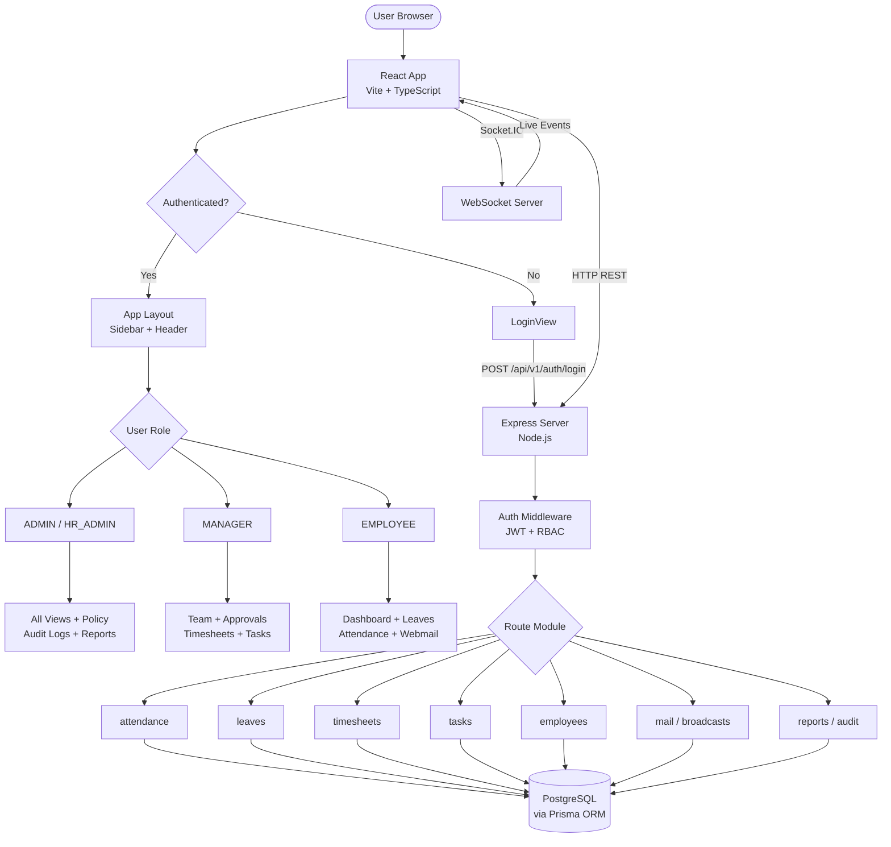
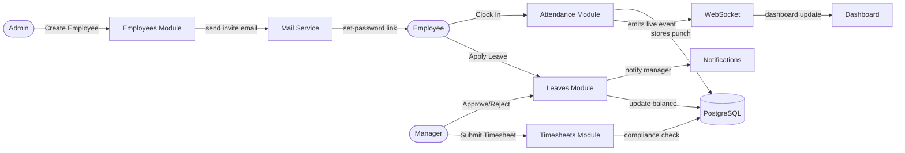

# Lexvera HRMS — Project Hierarchy & Flow

## Tech Stack Overview

```
Lexvera HRMS
├── client/          → React + TypeScript + Vite (Frontend)
└── server/          → Node.js + Express + Prisma (Backend)
```

---

## Project Directory Structure

```
Lexvera/
├── client/
│   └── src/
│       ├── App.tsx              # Root router & auth guard
│       ├── main.tsx             # Entry point
│       ├── context/             # Global state providers
│       │   ├── AuthContext      # User session & permissions
│       │   ├── AttendanceContext # Live punch state
│       │   ├── SocketContext    # WebSocket + toast system
│       │   └── ThemeContext     # Light / Dark mode
│       ├── components/          # Reusable UI components
│       │   ├── Sidebar
│       │   ├── Header
│       │   ├── ClockInModal
│       │   ├── ApplyLeaveModal
│       │   ├── RegularizationModal
│       │   ├── CreateTaskModal
│       │   ├── SubmitTimesheetModal
│       │   ├── EmployeeDetailDrawer
│       │   ├── NotificationDrawer
│       │   └── AddEmployeeModal
│       ├── views/               # Page-level views
│       │   ├── LoginView
│       │   ├── OverviewDashboard
│       │   ├── AttendanceView
│       │   ├── LeavesView
│       │   ├── TimesheetsView
│       │   ├── TasksView
│       │   ├── WebmailView
│       │   ├── BroadcastsView
│       │   ├── TeamView
│       │   ├── EmployeeManagementView
│       │   ├── EmployeeProfileView
│       │   ├── ReportsView
│       │   ├── PolicyManagementView
│       │   └── AuditLogsView
│       ├── pages/               # Role-specific pages
│       │   └── manager/
│       │       └── ManagerApprovalCenter
│       └── services/
│           └── api.ts           # Axios HTTP client
│
└── server/
    └── src/
        ├── server.ts            # Express app entry
        ├── config/              # DB, env config
        ├── middleware/          # Auth guard, RBAC
        ├── modules/             # Feature API handlers
        │   ├── auth             # Login / token / invite
        │   ├── employees        # CRUD, directory
        │   ├── attendance       # Clock-in/out, regularize
        │   ├── leaves           # Apply, approve, balance
        │   ├── timesheets       # Weekly logs, compliance
        │   ├── tasks            # Kanban tasks & projects
        │   ├── mail             # Internal webmail
        │   ├── broadcasts       # Company announcements
        │   ├── notifications    # Real-time alerts
        │   ├── reports          # Analytics exports
        │   ├── policies         # Shifts, leave rules
        │   ├── dashboard        # Aggregated stats
        │   ├── audit-logs       # Activity trail
        │   ├── roles            # RBAC management
        │   └── holidays         # Holiday calendar
        ├── websocket/           # Socket.IO real-time events
        ├── services/            # Email, notification service
        └── utils/               # Helpers & formatters
```

---

## Request Flow Diagram



---

## Role → Feature Access Map

| Feature | Admin | HR Admin | Manager | Employee |
|---|:---:|:---:|:---:|:---:|
| Dashboard | ✓ | ✓ | ✓ | ✓ |
| Attendance / Clock-In | — | — | ✓ | ✓ |
| Leave Management | ✓ | ✓ | ✓ | ✓ |
| Timesheets | ✓ | ✓ | ✓ | ✓ |
| Tasks & Projects | ✓ | ✓ | ✓ | ✓ |
| Webmail | ✓ | ✓ | ✓ | ✓ |
| Announcements | ✓ | ✓ | ✓ | ✓ |
| Approval Center | — | — | ✓ | — |
| Team Roster | ✓ | ✓ | ✓ | — |
| Employee Directory | ✓ | ✓ | — | — |
| Timesheet Compliance | ✓ | ✓ | — | — |
| Reports & Analytics | ✓ | ✓ | ✓ | — |
| Policies & Shifts | ✓ | ✓ | — | — |
| Audit Logs | ✓ | ✓ | — | — |

---

## Data Flow — Key Modules


